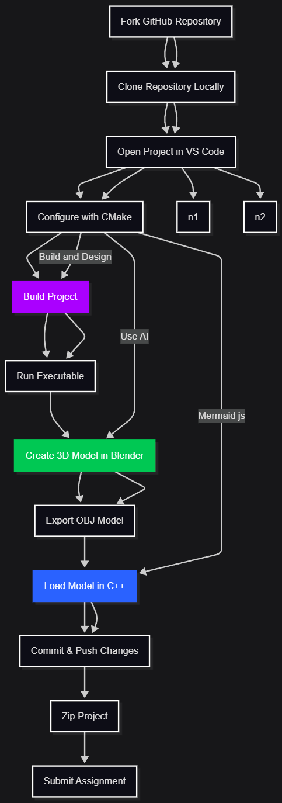
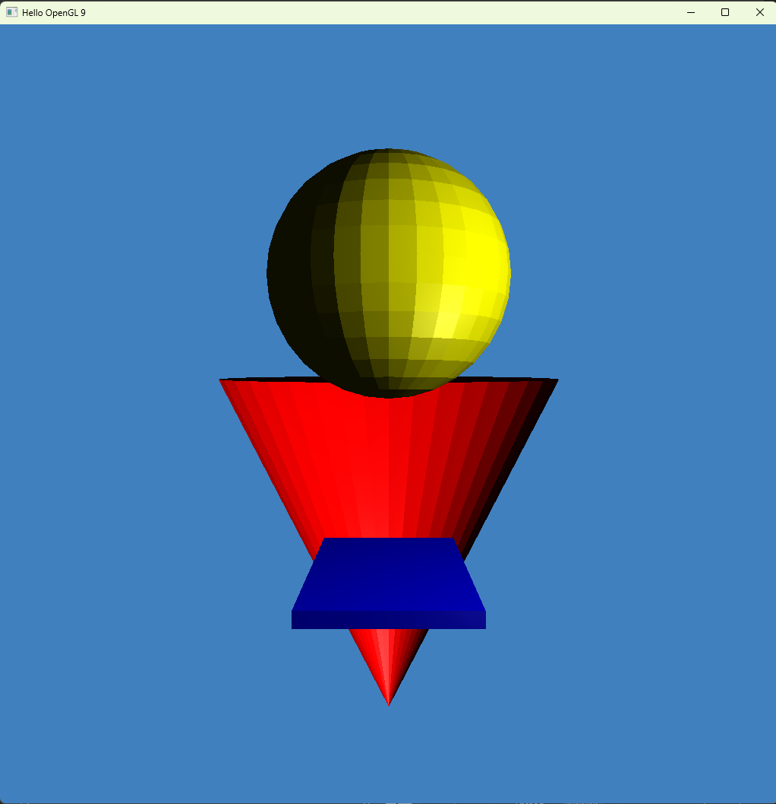
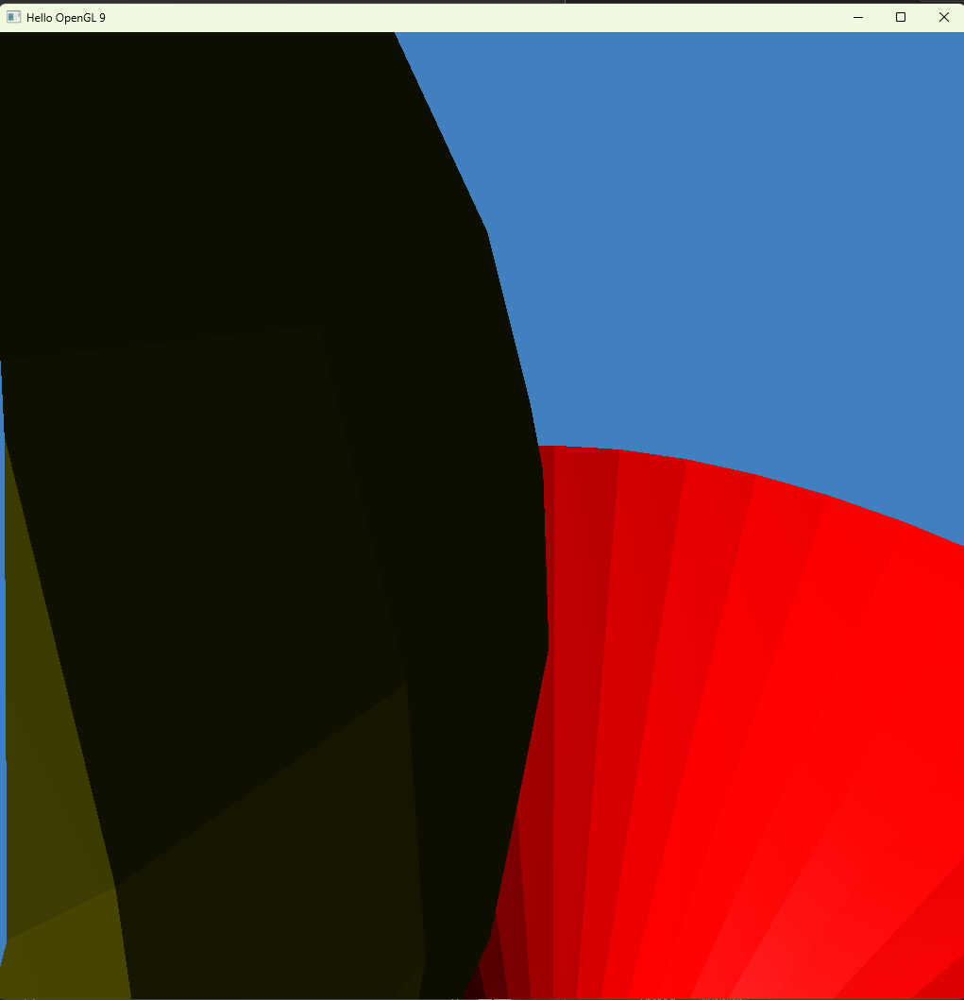
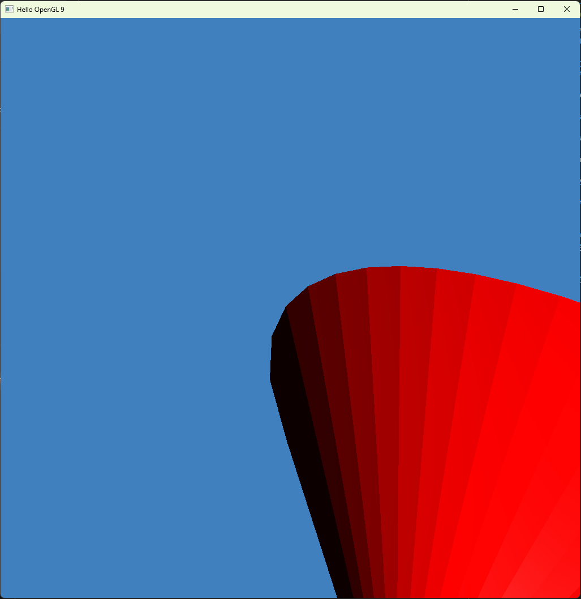

# Rendering, Graphics, and Bulletpoints
## Excercise in Graphics 100775045_5CM507_Project1

## Introduction
This document records the steps I followed while setting up, developing, building, and submitting my 3D Graphics project using GitHub, VS Code, Blender, and C++.

## Analytically 

### 1. Forking the Project Repository (Online)
1.1. Open a web browser (Chrome, Firefox, or Edge).

1.2. Sign in to your GitHub account at github.com.

1.3. Navigate to the repository: zhaoyoubing/proj02.

1.4. Click the Fork button to create your own copy of the project.

### 2. Download locally forked repo.
2.1. Open File Explorer (Windows key + E).

2.2. Create a directory, for example: C:\Uni\Graphics Fall\AssignmentFall

2.3. In the address bar, type cmd and press Enter to open the command prompt in that folder.

2.4. Clone your forked repository: git clone 
>https://github.com/iliathee/100775045_5CM507_Project1.git

2.5. Switch to the branch related to Lesson 10: git checkout LabA10_bloom
 
### 3. Opening the Project in Visual Studio Code

3.1. Launch Visual Studio Code.

3.2. Select File → Open Folder and choose the project directory.

3.3. When prompted, select Visual Studio 2022 arm64 compiler.

### 4. Configuring and Building with CMake

4.1. Open the CMake tab in VS Code.

4.2. Right-click CMakeLists.txt and choose Configure All Projects.

4.3. Right-click CMakeLists.txt again and select Build All Projects.

### 5. Running the Executable

5.1. Open the Run and Debug tab in VS Code.

5.2. Select Create launch.json → Windows (Launch).

5.3. Edit the launch.json file to match your paths, for example: 

>"program": "C:/Uni/Graphics Fall/AssignmentFall/100775045_5CM507_Project1/build/Debug/run01.exe",
"cwd": "C:/Uni/Graphics Fall/AssignmentFall/100775045_5CM507_Project1/build/Debug"

5.4. Press the Play button to run the project in debug mode.

### 6. Creating a Custom 3D Object in Blender

6.1. Open Blender.

6.2. Add a mesh: Add → Mesh → Sphere.

6.3. In Object Mode, press S to scale and X to resize along one axis.

6.4. Apply transformations using Shift + A → Apply All Transforms.

6.5. Assign a material and change its color.

6.6. Export the model as .obj with Triangulate Meshes and Colors enabled.

6.7. Save the file in proj02/models.

### 7. Loading the OBJ Model in C++ (main.cpp)

7.1. Create and initialize a mesh: 

>std::shared_ptr<Mesh> sphere = std::make_shared<Mesh>();
sphere->init("models/sphere.obj", blinnShader);

7.2. Create a node:

>std::shared_ptr<Node> sphereNode = std::make_shared<Node>();

7.3. Attach the mesh to the node with transformations:

>sphereNode->addMesh(
    sphere,
    glm::mat4(1.0f),
    glm::rotate(glm::radians(45.0f), glm::vec3(0.0f, 1.0f, 0.0f))
);

7.4. Add the node to the scene:

>scene->addChild(
    sphereNode,
    glm::translate(glm::vec3(1.0f, 1.5f, 0.5f))
);

7.5. Rebuild and run the project following Steps 4 and 5.

### 8. Writing Project Documentation

8.1. Create a wiki folder in the root directory.

8.2. Inside it, create a Readme.md file.

8.3. Include:

A title (e.g., Rendering, Graphics, and Bulletpoints)

Sections and subtitles

Block quotes, tables, images, and Mermaid diagrams

### 9. Committing and Pushing Changes

9.1. Open the command prompt in the project folder.

9.2. Stage all changes: git add .

9.3. Commit locally: git commit -m "Rendering, Graphics, and Bulletpoints"

9.4. Push changes to your remote repository: git push

### 10. Submitting the Assignment

10.1. Zip the entire project folder.

10.2. Upload the zip file to Udo.

## Example Mermaid Diagram (Project Workflow)

## Screenshots of Project

